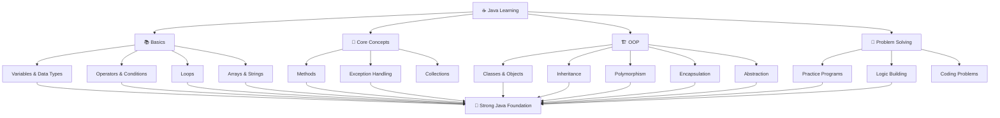

# ☕ Java Learning Journey

Welcome to my Java repository!  
This repo contains my learning journey with Java, covering core concepts, Object-Oriented Programming, practice programs, and problem-solving.

---

## 🔀 Learning Journey



---

## ✨ Repository Highlights

- 🧑‍💻 Beginner-friendly Java programs
- 📖 Concept-based learning
- 🧠 Practice and problem-solving
- 🏗️ Object-Oriented Programming examples
- 📈 Regularly updated with new concepts and programs


---
## 📚 Topics Covered

- ✅ Java Basics
- ✅ Variables & Data Types
- ✅ Operators & Conditions
- ✅ Loops
- ✅ Arrays & Strings
- ✅ Methods & Functions
- ✅ Object-Oriented Programming (OOP)
- ✅ Classes & Objects
- ✅ Inheritance
- ✅ Polymorphism
- ✅ Encapsulation
- ✅ Abstraction
- ✅ Exception Handling
- ✅ Collections
- ✅ Practice Problems

---

## 🛠️ Tech Used

- **Java**
- **Object-Oriented Programming**
- **Java Collections Framework**

---

## 🎯 Goal

My goal is to build a strong foundation in Java by:

- Practicing regularly
- Understanding core concepts
- Improving problem-solving skills
- Building programs using Java

---

## 📂 Repository Structure

```text
Java/
│
├── Basics/
├── Arrays/
├── Strings/
├── Functions/
├── OOP/
├── ExceptionHandling/
├── Collections/
├── Practice/
└── README.md
```

---

## 📈 Progress

🚧 Currently learning and updating this repository regularly.

---

## 🤝 Contributions

This is a personal learning repository, but suggestions and feedback are always welcome!

---

## ⭐ Support

If you find this repository helpful, consider giving it a ⭐ on GitHub!

---

## 👨‍💻 Author

**Sumit Kumar**

GitHub: [@sumitkumar2374](https://github.com/sumitkumar2374)

---

> 💡 *“Consistency beats talent when talent doesn’t work hard.”*
